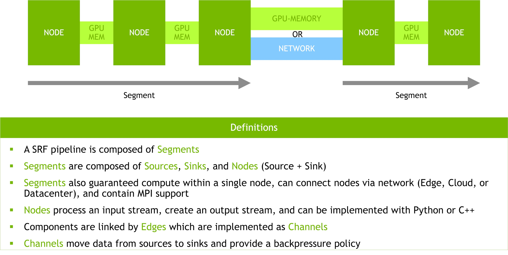

<!-- omit in toc -->
# Streaming Reactive Framework (SRF)

The **Streaming Reactive Framework** (SRF) library (proununced "surf") is a **reactive, network-aware, flexible, and performance-oriented streaming data framework** that standardizes building modular and reusable pipelines with both C++ and Python​. The goal of SRF is to serve as a common high-performance streaming data layer in which all personas of developers - ranging from Data Scientists to DevOps and Performance Engineers can find value.

<!-- omit in toc -->
### Major features and differentiators
 - Built in C++ for performance, with Python bindings for ease of use and rapid prototyping, with options for maximizing performance
 - Distributed computation with message transfers over RDMA using UCX
 - Dynamic reconfiguration to scale up and out at runtime​; requires no changes to pipeline configuration
 - Unopinionated data model: messages of any type can be used in the pipeline
 - Built from the ground up with asynchronous computation for mitigation of I/O and GPU blocking
 - Automatically handles backpressure (when the sender is operating faster than the receiver can keep up) and reschedules computation as needed

<!-- omit in toc -->
### Anatomy of a SRF Pipeline



<!-- omit in toc -->
## Table of Contents
- [Installation](#installation)
  - [Prerequisites](#prerequisites)
  - [Conda Installation](#conda-installation)
    - [Python Bindings](#python-bindings)
    - [C++ Bindings](#c-bindings)
    - [Full SRF Library](#full-srf-library)
    - [Optional Settings](#optional-settings)
  - [Source Installation](#source-installation)
  - [Docker Installation](#docker-installation)
- [Quickstart Guide](#quickstart-guide)
- [Contributing](#contributing)
  - [Third-Party code](#third-party-code)


## Installation
SRF includes both Python and C++ bindings and supports installation via [conda](https://docs.conda.io/en/latest/), Docker, or from source.

### Prerequisites

- Pascal architecture (Compute capability 6.0) or better
- NVIDIA driver `450.80.02` or higher
- [conda or miniconda](https://conda.io/projects/conda/en/latest/user-guide/install/linux.html)
- If using Docker:
  - [Docker](https://docs.docker.com/get-docker/)
  - [The NVIDIA container toolkit](https://docs.nvidia.com/datacenter/cloud-native/container-toolkit/install-guide.html#docker)

### Conda Installation
Installing via Conda is the easiest method for getting the SRF components and supports both the Python and C++ bindings. To install the SRF conda package and build the C++ and hybrid components, follow the steps below. Please note, Conda performance can be greatly increased via [Mamba](https://github.com/mamba-org/mamba). To install Mamba in an existing Conda environment, simply run:

```bash
conda install -c conda-forge mamba
```

If you choose to use Mamba rather than Conda, simply replace `conda` with `mamba` in the instructions below.

#### Python Bindings
```bash
# If needed, create a new conda environment
conda create --name srf python=3.8

# Activate the newly created conda environment
conda activate srf

# Install SRF Python bindings
conda install -c rapidsai -c nvidia -c conda-forge srf
```

#### C++ Bindings
```bash
# If needed, create a new conda environment
conda create --name srf python=3.8

# Activate the newly created conda environment
conda activate srf

# Install SRF Python bindings
conda install -c rapidsai -c nvidia -c conda-forge libsrf
```

#### Full SRF Library
```bash
# If needed, create a new conda environment
conda create --name srf python=3.8

# Activate the newly created conda environment
conda activate srf

# Install SRF Python bindings
conda install -c rapidsai -c nvidia -c conda-forge srf libsrf
```

#### Optional Settings
To avoid specifying the channels in the Conda commands above:
```bash
conda config --env --add channels conda-forge &&\
conda config --env --add channels nvidia &&\
conda config --env --add channels rapidsai
```

And to opt-in to nightly releases:
```bash
conda config --env --add channels nvidia/label/dev &&
conda config --env --add channels rapidsai-nightly
```

### Source Installation
Installing via source is for more advanced users and is necessary to try SRF features before an official release. 

<!-- omit in toc -->
#### Clone SRF repository
```bash
export $SRF_HOME=$(pwd)/srf
git clone git@github.com:nv-morpheus/srf.git $SRF_HOME
cd $SRF_HOME
```
<!-- omit in toc -->
#### Create SRF Conda Environment
```bash
# note: `mamba` may be used in place of `conda` for better performance.
conda env create -n srf-dev --file $SRF_HOME/ci/conda/environments/dev_env.yml
conda activate srf-dev
```
<!-- omit in toc -->
#### Build SRF
```bash
mkdir $SRF_HOME/build
cd $SRF_HOME/build
cmake ..
make -j $(nproc)
```
<!-- omit in toc -->
#### Run SRF C++ Tests
```bash
export SRF_TEST_INTERNAL_DATA_PATH=$SRF_HOME/src/tests
$SRF_HOME/build/src/tests/test_srf_private.x
$SRF_HOME/build/tests/test_srf.x
$SRF_HOME/build/tests/logging/test_srf_logging.x
```
<!-- omit in toc -->
#### Install SRF Python Bindings
```bash
pip install -e $SRF_HOME/python
```
<!-- omit in toc -->
#### Run SRF Python Tests
```bash
pytest $SRF_HOME/python
```

### Docker Installation
A Dockerfile is provided at `$SRF_HOME` and can be built with
```bash
docker build -t srf:latest .
```
To run the container
```bash
docker run --gpus all --rm -it srf:latest /bin/bash
```

## Quickstart Guide

To quickly learn about both the C++ and Python SRF APIs, including following along with various complexity examples, we recommend following the SRF Quickstart Repository located [here](/docs/quickstart/README.md). This tutorial walks new users through topics like
- Creating a simple SRF pipeline
- Using a custom datatype between SRF nodes
- Using Reactive-style operators inside nodes for complex functionality
- Understand how threads and buffers can effect performance
- Mixing C++ and Python, for example - defining compute nodes in C++ and calling them from Python

## Contributing
To learn how to contribute to SRF, please read the [Contribution Guide](CONTRIBUTING.md).

SRF is licensed under the Apache v2.0 license. All new source files including CMake and other build scripts should contain the Apache v2.0 license header. Any edits to existing source code should update the date range of the copyright to the current year. The format for the license header is:

```
/*
 * SPDX-FileCopyrightText: Copyright (c) <year>, NVIDIA CORPORATION & AFFILIATES. All rights reserved.
 * SPDX-License-Identifier: Apache-2.0
 *
 * Licensed under the Apache License, Version 2.0 (the "License");
 * you may not use this file except in compliance with the License.
 * You may obtain a copy of the License at
 *
 * http://www.apache.org/licenses/LICENSE-2.0
 *
 * Unless required by applicable law or agreed to in writing, software
 * distributed under the License is distributed on an "AS IS" BASIS,
 * WITHOUT WARRANTIES OR CONDITIONS OF ANY KIND, either express or implied.
 * See the License for the specific language governing permissions and
 * limitations under the License.
 */
 ```

### Third-Party code
Thirdparty code included in the source tree (that is not pulled in as an external dependency) must be compatible with the Apache v2.0 license and should retain the original license along with a url to the source. If this code is modified, it should contain both the Apache v2.0 license followed by the original license of the code and the url to the original code.

Ex:
```
/**
 * SPDX-FileCopyrightText: Copyright (c) 2018-2021, NVIDIA CORPORATION & AFFILIATES. All rights reserved.
 * SPDX-License-Identifier: Apache-2.0
 *
 * Licensed under the Apache License, Version 2.0 (the "License");
 * you may not use this file except in compliance with the License.
 * You may obtain a copy of the License at
 *
 * http://www.apache.org/licenses/LICENSE-2.0
 *
 * Unless required by applicable law or agreed to in writing, software
 * distributed under the License is distributed on an "AS IS" BASIS,
 * WITHOUT WARRANTIES OR CONDITIONS OF ANY KIND, either express or implied.
 * See the License for the specific language governing permissions and
 * limitations under the License.
 */

//
// Original Source: https://github.com/org/other_project
//
// Original License:
// ...
```
